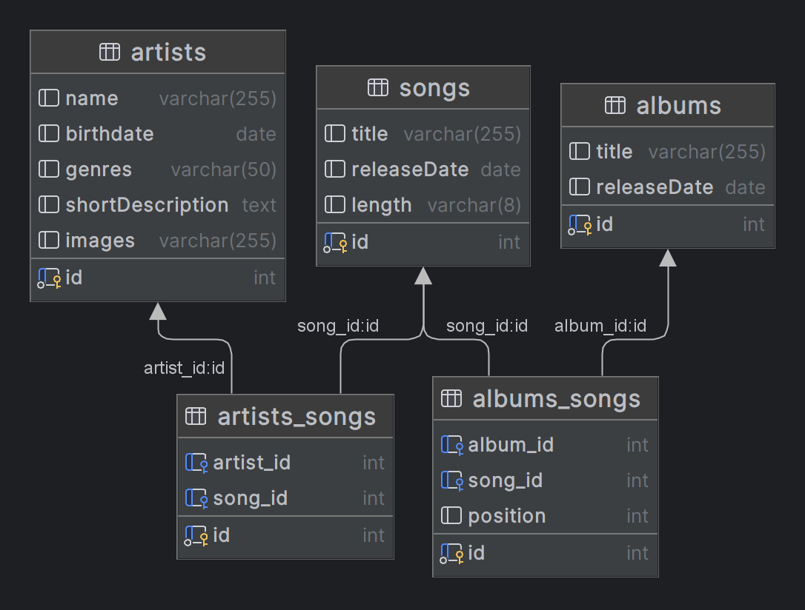

# Musik Database App

Dette repository indeholder en simpel musikdatabaseapp, der giver dig mulighed for at søge efter artister, albums og sange. Du kan finde mere information om app'en herunder.

### Links til reposetories:

- [Backend Repository](https://github.com/Abdiox/music-database)
- [Deployet Backend](https://music-database.azurewebsites.net/)
- [Frontend Repository](https://github.com/emsc0001/music-database-frontend)
- [Deployet Frontend (GitHub Pages)](https://emsc0001.github.io/music-database-frontend/?fbclid=IwAR2rFZHkzk7ITrNGgjF4aWqp8s_JHQDah3KgTl9PNTfAUPk5JSUYXVGn-c8)

## Installation

Følg disse trin for at installere og køre app'en lokalt på din computer.

### Backend

1. Klon dette repository til din lokale maskine ved at køre følgende kommando i din terminal:

_Husk at kører kommandolinjen bash_
git clone: <https://github.com/Abdiox/music-database>

2. cd <music-database>

3. npm install

_Husk at install de nødvendige dependencies til din package.json fil_ 4. npm install mysql2
npm install express
npm install dotenv
npm install cors
npm install npm install debug

5. npm start

6. app:startup App Started Succesfully +0ms
   Serveren kører på http://localhost:3333

### Brug

Når både backend og frontend er startet, kan du åbne din webbrowser og besøge http://localhost:3333 for at bruge app'en.

### Deployede Versioner

Backend er deployet på:
Frontend er åben på GitHub Pages og kan tilgås her: [Link til deployet Frontend](https://emsc0001.github.io/music-database-frontend/?fbclid=IwAR2rFZHkzk7ITrNGgjF4aWqp8s_JHQDah3KgTl9PNTfAUPk5JSUYXVGn-c8)

### Web-applikation, deployet til Azure:

[Live Webapplikation på Azure](https://music-database.azurewebsites.net/)

## ER-Diagram:

